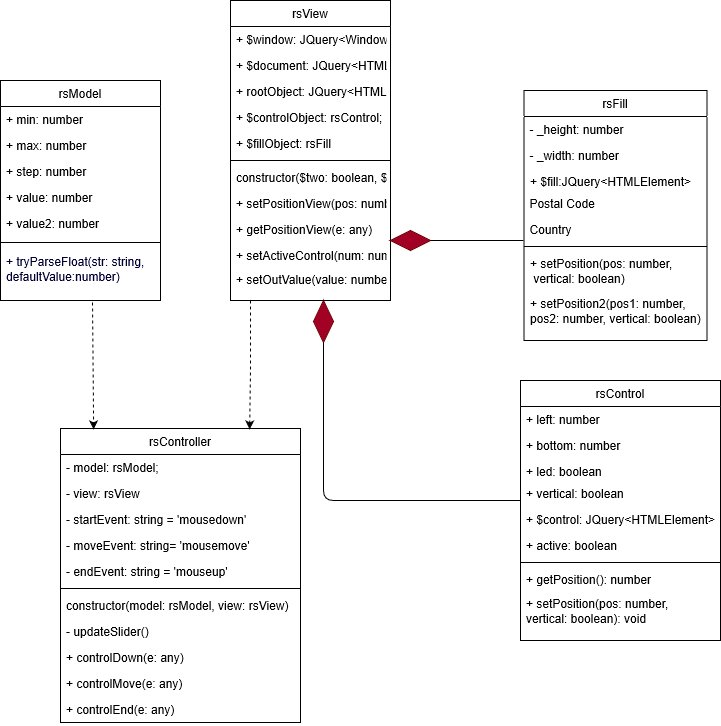

# rSlider1410 (Слайдер)
Слайдер тестового задания (Александр Егоров)

Ссылка на страницу со слайдерами(развернут на github): https://saitabaita.github.io/rSlider1410/dist/

Запускать сайт через http://localhost:8083

# Описание архитектуры.

В приложении три слоя: Model, View и Controller. Модель (самый абстрактный слой) хранит только атрибуты слайдера: max, min, step, value. View служит для отображения модели включает в себя два класса: rsController (класс бегунка) и rsFill (класс заполнителя). Model и View непосредственно не связаны. Controller - слой, который использует Model и View. При отключенном Controller слайдеры только отображаются на странице(они не инициализированны). Controller инициализирует слайдеры (данные Model сообщает View) и подписывается на 3 события мыши (нажатие кнопки, движение мыши, отпуск кнопки мыши). Все расчеты производит Controller на основании данных модели и координат мыши, полученных из View. После нажатия на кнопку мыши Controller регистрирует еще два события мыши: движение и отпуск кнопки. Обработчики этих событий управляют отображением слайдера, изменяя положение бегунка и пр. В параметрах запуска слайдера можно сделать его вертикальным или с двумя бегунками.

Косяков будет много. Не могу долго сидеть над задачей. Если есть время (самоизоляция дала мне его) стараюсь максимально быстро завершить процесс. 

# Параметры для создания слайдера:

ширина:string, 

min: number, 

max: number, 

step: number, 

начальное значение: number, 

vertical: boolean, 

два слайдера: boolean

<b>UML диаграмма:</b>

